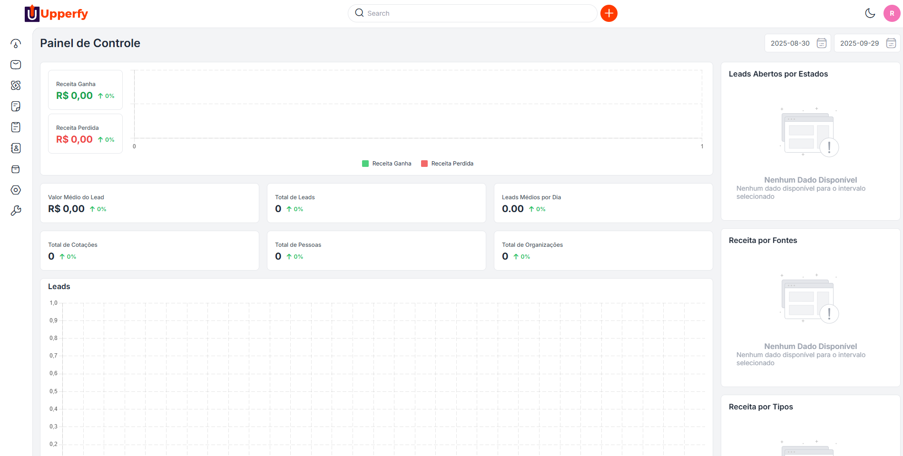

<p align="center">
<a href="https://upperfy.com.br"></a>
</p>

<p align="center">

</p>


## Topics

1. [Introduction](#introduction)
2. [Requirements](#requirements)
3. [Installation & Configuration](#installation-and-configuration)
4. [License](#license)
5. [Security Vulnerabilities](#security-vulnerabilities)

### Introduction

**Upper CRM** is a derivative work licensed under the **Open Software License (OSL v. 3.0)**. The core source code is made available free of charge under the terms of this license.

We handle all the technical complexity—including **hosting, security, and backups**—so you and your team can focus entirely on building and managing customer relationships.

**Free & Opensource Laravel CRM solution for SMEs and Enterprises for complete customer lifecycle management.**

### Requirements

-   **SERVER**: Apache 2 or NGINX.
-   **RAM**: 3 GB or higher.
-   **PHP**: 8.1 or higher
-   **For MySQL users**: 5.7.23 or higher.
-   **For MariaDB users**: 10.2.7 or Higher.
-   **Node**: 8.11.3 LTS or higher.
-   **Composer**: 2.5 or higher

### Installation and Configuration

1. Clone Repository
2. Copy .env.example and configure 
    - Change the **APP_URL** param to your **domain**. 
    - Configure the **Database** parameters inside **.env** file.
3. Create databases
     ```
        CREATE DATABASE IF NOT EXISTS application CHARACTER SET utf8mb4 COLLATE utf8mb4_unicode_ci;
        CREATE DATABASE IF NOT EXISTS application_testing CHARACTER SET utf8mb4 COLLATE utf8mb4_unicode_ci;
    ```
4. Acess container and execute the next step
5. Dependencies & configs 
    ```
        composer install
        php artisan key:generate
        php artisan optimize:clear
        php artisan migrate:fresh --seed 
        php artisan storage:link 
        php artisan vendor:publish --provider='Webkul\\Core\\Providers\\CoreServiceProvider' --force 
        php artisan optimize:clear
    ```

**How to log in as admin:**

> _http(s)://example.com/admin/login_

```
email:admin@example.com
password:admin123
```

### 📜 License and Attribution

This source code is a derivative work licensed under the **Open Software License (OSL v. 3.0)**. 

For complete details regarding the copyright attribution and legal terms, please refer to the [`NOTICE.txt`](NOTICE.txt) and [`LICENSE`](LICENSE) files located in the root directory of this repository.

### Security Vulnerabilities

Please don't disclose security vulnerabilities publicly. If you find any security vulnerability in Upperfy CRM then please email us: contato@upperfy.com.br.


